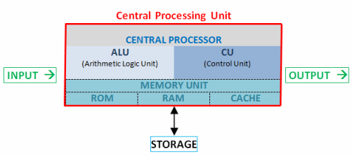

@title[Introduction]

Reversing para newbies
 

 
con Radare2

---

@title[whoami]

### $ whoami

1. Curioso del reversing desde los 15 años.
2. Miembro de kUT hasta su fin (2003-04).
3. Sysadmin.
4. Dejo cosas a medias en inceptor.me y tengo un doppelgänger en Twitter @jr_lambea.
5. Eterno aprendiz.

---

@title[resume]

### TL;DR

* Reverse engineering (RE), wtf?!
* Procesadores y arquitecturas.
* ASM y opcodes.
* Estructura básica de ejecutables

---

@title[what's reverse engineering]

### L33t me in motherf*cker!

La RE se basa en el aprendizaje de funcionamiento de un mecanismo sin información previa. Luego puede ser usado para alterar ese funcionamiento o reproducirlo en otro sitio. Durante la historia el concepto de RE ha ido mutando según el uso que se le daba.

---

@title[what's reverse engineering]

* En los 80 los poke asaltaban las revistas de videojuegos.
* En los 90 nació el concepto de cracking, loaders, trainers, keygens, parches, unpackers... era y es un arte (scene). A finales de los 90 aparece el exploiting de corrupción de memoria.
* En los 2000 muerte de la scene, el concepto de Teams y la forma de compartir cambia, el conocimiento se diversifica, se centra el reversing para el exploiting.
* Actualmente exploiting y malware analysis.

---

@title[CPU]

### Central processing unit

El procesador se encarga de procesar los datos residentes en los diferentes tipos de soportes de memoria.

Pero cómo?

---

@title[processor parts]

### Procesador

* Unidad de control: Ejecuta el flujo del código.
* Unidad aritmetico-lógica: Realiza operaciones matemáticas (sumas, restas, xor...), cada procesador puede tener diferentes implementaciones para estas funciones.
* Registros: Elementos de almacenamiento. A la capacidad máxima de estos se les llama `word` definen los bits del procesador (8, 16, 32, 64), consecuentemente también el límite de direccionamiento.

---

@title[processor example]

### Procesador

